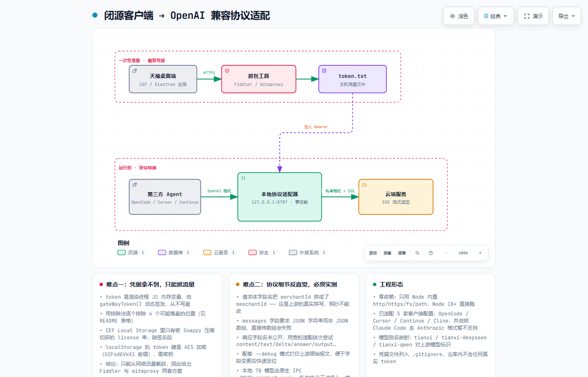

# 天禧 AI 接入第三方 Agent

> ## ⚠️ 免责声明（请先读这一段）
>
> 本项目是**个人学习性质的互操作性研究**，目的是理解一个闭源桌面客户端的
> 网络协议与鉴权流程，并据此做协议适配。
>
> - **必须使用你自己账号的凭据**。项目不包含、也不需要任何绕过付费或权限的能力。
> - **不修改、不反编译、不破解客户端本体**。只观察它自己的网络流量。
> - **不提供、不鼓励对外提供服务**。仅供本机自用。
> - 相关服务条款可能不允许此类接入，**使用前请自行确认**；由此产生的后果由使用者自负。
> - 官方接口一旦变更，本项目随时可能失效，这是预期内的。
>
> 如果你在找一个"能白嫖模型"的东西，这里没有。它只是一个**协议适配器**。

把联想天禧（个人超级智能体）的云端能力包装成标准 **OpenAI 兼容接口**，任何支持 OpenAI API 的
第三方 agent 都能直接接进来用。

```
┌──────────────────┐  OpenAI 格式  ┌────────────────┐  天禧私有格式  ┌─────────────────┐
│ OpenCode / Cursor│ ────────────► │ 本代理          │ ─────────────► │ ai.lenovomm.com │
│ Continue / Cline │ ◄──────────── │ 127.0.0.1:8787 │ ◄───────────── │  (SSE 流式)     │
└──────────────────┘  OpenAI 格式  │ 注入 Bearer    │                └─────────────────┘
                                   └────────────────┘
```

**已验证**：`/health`、`/v1/models`、`/v1/chat/completions` 三个端点均正常工作。
**待你完成**：抓包拿到 token（下面第一步），因为它不落盘、无法自动提取。

**代码规模**：`proxy.js` 323 行 + `get-token.js` 116 行，**零依赖**（只用 Node 内置模块，Node 18+ 即可跑）。

## 架构



> 可缩放 / 可导出 SVG 的交互版本：[`docs/architecture.html`](docs/architecture.html)

---


---

## 第一步：拿到 token（唯一必须的手动操作）

### 为什么不能自动提取

天禧的 `AI_TOKEN` 是渲染进程 JS 内存里的变量（`window.AI_TOKEN`），由 `gateWayToken()` 动态签发，
**从不写入磁盘**。已实测排除的落盘位置：

| 位置 | 结果 |
|------|------|
| CEF Local Storage（`cefcache\Local Storage\leveldb`） | 只有被 Snappy 压缩切碎的 **license** 串（缺签名段），不是 access token |
| CEF Cookies（SQLite） | 无 JWT |
| `storagedb\*.db`、各 `*.dat` | 无 JWT |
| localStorage 的 `token` 键 | AES 加密（`U2FsdGVkX1` 前缀），需密钥 |

`node get-token.js scan` 可以复现上述排查结论。

### 做法 A：Fiddler Classic（推荐，图形界面）

1. 装 [Fiddler Classic](https://www.telerik.com/fiddler/fiddler-classic)（免费）
2. `Tools → Options → HTTPS` → 勾 **Decrypt HTTPS traffic**，按提示信任它的根证书
3. 确认左下角 `Capturing` 是开启的（或按 F12）
4. 打开天禧，**随便发一条消息**
5. 在会话列表里找 host 为 `ai.lenovomm.com`、路径含 `cloud-ai-core/rest/v1/chat/completion` 的那条
6. 右侧 `Inspectors → Headers`，找到 `Authorization: Bearer eyJ...`
7. 复制 **Bearer 后面那串**（不要带 `Bearer ` 前缀），执行：

```bash
node get-token.js save "eyJhbGciOiJSUzI1NiIsInR5cCI6..."
```

### 做法 B：mitmproxy（命令行）

```bash
pip install mitmproxy
mitmproxy --listen-port 8888
# 系统代理设为 127.0.0.1:8888，浏览器打开 http://mitm.it 装证书
# 天禧发一条消息，在列表里找到 chat/completion 请求，看 Authorization 头
```

### 检查

```bash
node get-token.js check    # 会告诉你 token 什么时候过期
```

---

## 第二步：启动代理

```bash
node proxy.js              # 默认 127.0.0.1:8787
node proxy.js --debug      # 打印天禧原始响应，便于适配字段
TX_PORT=9000 node proxy.js # 换端口
```

看到这个就成了：

```
  天禧 AI → OpenAI 兼容代理已启动
  监听      http://127.0.0.1:8787
  Token     已加载
```

代理是零依赖的，只用 Node 内置模块，Node 18+ 即可。

---

## 第三步：配置第三方 agent

通用参数，照抄到任何 OpenAI 兼容的客户端：

```
baseURL = http://127.0.0.1:8787/v1
apiKey  = 随便填（本代理不校验，真 token 从 token.txt 读）
model   = tianxi
```

### OpenCode（`~/.config/opencode/opencode.json`）

```json
{
  "provider": {
    "tianxi": {
      "npm": "@ai-sdk/openai-compatible",
      "name": "Tianxi",
      "options": {
        "baseURL": "http://127.0.0.1:8787/v1",
        "apiKey": "dummy"
      },
      "models": {
        "tianxi": { "name": "天禧" }
      }
    }
  },
  "model": "tianxi/tianxi"
}
```

### Cursor

`Settings → Models` → 打开 `OpenAI API Key`，填任意值；
再打开 `Override OpenAI Base URL`，填 `http://127.0.0.1:8787/v1`；模型列表里加 `tianxi`。

### Continue（VS Code / JetBrains，`.continue/config.yaml`）

```yaml
models:
  - name: 天禧
    provider: openai
    model: tianxi
    apiBase: http://127.0.0.1:8787/v1
    apiKey: dummy
```

### Cline / Roo Code

Provider 选 `OpenAI Compatible`，Base URL 填 `http://127.0.0.1:8787/v1`，Model ID 填 `tianxi`。

### Claude Code

⚠️ Claude Code 走的是 **Anthropic 格式**，不是 OpenAI 格式，本代理暂不支持。
需要的话得再加一层 Anthropic → OpenAI 的转换（可以后续补）。

### 命令行自测

```bash
curl http://127.0.0.1:8787/v1/chat/completions \
  -H "Content-Type: application/json" \
  -d '{"model":"tianxi","messages":[{"role":"user","content":"你好"}],"stream":true}'
```

---

## 接口细节（逆向所得，供二次开发）

**端点**：`POST https://ai.lenovomm.com/cloud-ai-core/rest/v1/chat/completion`

**请求体**：

```jsonc
{
  "disableSearch": true,
  "stream": true,
  "meechantId": "1213110283744128",   // 注意：天禧源码里就是这个拼写，别改成 merchantId
  "pluginIds": "[]",
  "enableTrace": true,
  "maxOutputTokens": 2048,
  "promptCode": "",
  "version": "4.2.1.8111",
  "user": "<uuid>",
  "hasSystem": false,
  "messages": "[{\"role\":\"user\",\"content\":\"...\"}]"   // 注意：是 JSON 字符串，不是数组
}
```

**鉴权**：`Authorization: Bearer <token>`

**响应**：SSE（`text/event-stream`），每行 `data: {...}`，`[DONE]` 结束。
已知错误码：`1050`（流结束）、`1207`、`1208`。

其他可用端点（同源，同一套鉴权）：

```
/cloud-ai-core/commercial/v1/function/chat     对话（function calling）
/cloud-ai-core/commercial/v1/generateImg       生图
/cloud-ai-core/commercial/v1/loadImage
xiaotian-slot/api/pc/slot/v1/op/extract        槽位抽取（挂 laa.lenovomm.com/）
```

**响应字段适配**：天禧的流式字段名未公开，`proxy.js` 里的 `pickText()` 做了宽松适配
（依次尝试 `content`/`text`/`delta`/`answer`/`data`…）。如果接上后发现输出为空，
用 `--debug` 跑一次，看天禧实际返回的字段名，改一下 `pickText()` 即可。

---

## 关于本地 7B 模型

天禧内置了本地小模型，走的是 **OpenAI 兼容的 `/v1/chat/completions`**，模型名 `Model-7b`、
`IntentModel`、`BaiDuSafetyChecker`。但它的服务地址是通过**原生 IPC** 拿的：

```js
getLMIntentServer()  →  window.pcmjssdk.asyncSendIPCMessage(..., "WSPluginHost.exe", true)
```

私有协议、不对外，第三方程序接不了。所以本代理走的是云端路线。
（如果只是想要本地小模型，直接用你已装的 Ollama + `qwen2.5-coder:7b` 更省事。）

---

## 注意事项

- **仅供自用**。这是逆向出来的非公开接口，可能不符合联想的服务条款，别拿去对外提供服务。
- **token 会过期**，过期后代理会报 401，重新抓一次即可。
- **天禧更新可能改接口**，届时按 `--debug` 的报文调整请求体或字段映射。
- `token.txt` 等同于你的登录凭据，**别提交到 git、别外传**。
